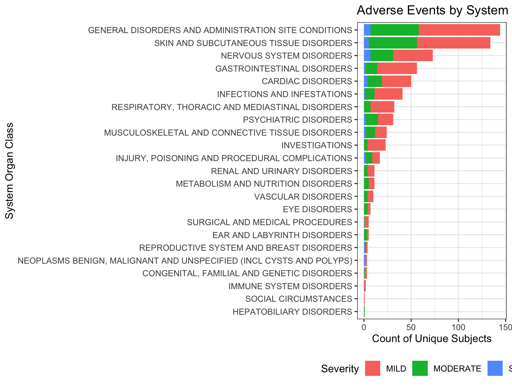

# AprilC-RVA-Coding-Assessment
Each folder is self-contained — the R script produces the output file(s) in the same directory

## Repository Structure
```
AprilC-RVA-Coding-Assessment/
├── README.md
├── Q1/
│   ├── Q1.R              # TEAE summary table script
│   └── teae_table.html   # Rendered HTML output
├── Q2/
│   ├── Q2.R              # AE severity bar chart script
│   └── ae_severity_plot.png  # PNG output
└── Q3/
    ├── Q3.R              # Interactive Shiny app script
    └── Q3_Answer         # Deployment notes
```
---

## Question 1: TEAE Summary Table
**Approach:** Filtered ADAE to treatment-emergent AEs (`TRTEMFL == "Y"`) and used
`tbl_hierarchical()` from `{gtsummary}` to build a hierarchical summary table with SOC
and Preferred Term rows, treatment arm columns, ADSL as the denominator, and a top-level
summary row. Exported to HTML via `gt::gtsave()`.

**Output:** HTML table
🔗 [View Summary table](https://avril471.github.io/AprilC-RVA-Coding-Assessment/Q1/teae_table.html)

---

## Question 2: AE Severity Visualization
**Approach:** Deduplicated ADAE to one record per subject per SOC per severity, calculated
total subjects per SOC for ordering, then built a stacked horizontal bar chart using
`{ggplot2}` colored by severity. Bars are ordered by increasing subject frequency.

**Output:** 


---

## Question 3: Interactive R Shiny Application
**Approach:** Integrated the Q2 visualization into a Shiny dashboard. Data preparation
is done outside the server for efficiency. A `checkboxGroupInput` filters by Treatment
Arm (`ACTARM`), with SOC ordering recalculating reactively based on the current selection.

**Output:** Live Shiny app
🔗 [Launch Shiny App](https://choqyy-april-cheng.shinyapps.io/RVA-Q3-Shiny)
